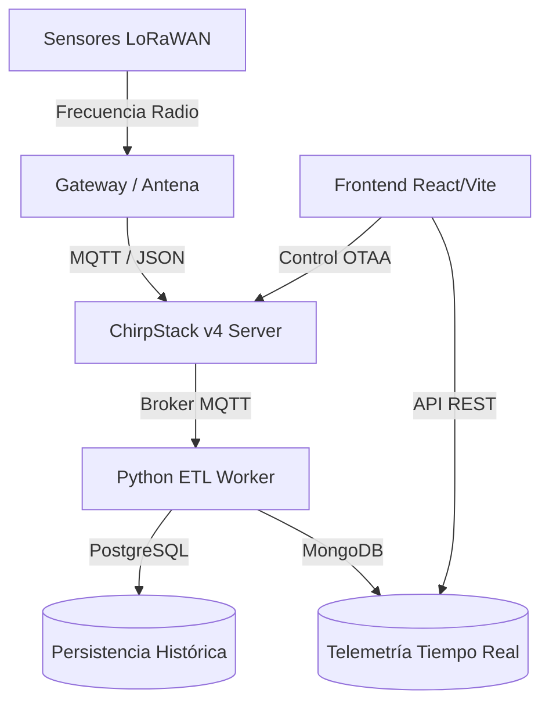

# 🛠️ Technical Blueprint: IoT Commander SaaS (SGA Data)

Este documento es una guía de alta ingeniería para el equipo de desarrollo de **SGA Data**. Aquí se detalla la arquitectura, el stack tecnológico y la lógica de integración del ecosistema IoT construido.

---

## 1. Arquitectura del Sistema
El sistema se divide en dos grandes piezas desacopladas para garantizar escalabilidad y portabilidad a servidores en la nube (VPS).

---

## 2. Frontend: Portal de Gestión (IoT Portal)
Ubicación local: `\iot-saas-portal`
Repo GitHub: `https://github.com/sgadata/iot-saas-portal`

### 📚 Stack Tecnológico
- **Core:** React 19 + Vite (Moderno, ultrarrápido y liviano).
- **Enrutamiento:** `react-router-dom` con **HashRouter** (Optimizado para evitar errores 404 en GitHub Pages).
- **Estilos:** **Vanilla CSS** puro con variables CSS personalizadas. Se ha evitado Tailwind para mantener control total sobre el diseño "Premium Dark" sin dependencias pesadas.
- **Iconografía:** Lucide React.
- **Gráficos:** **Recharts** (SVG responsivo para las curvas de telemetría).
- **Mapas:** **Leaflet.js**. Utilizamos el motor abierto de **OpenStreetMap** con una capa CSS de inversión de color para el modo oscuro, evitando costes de APIs propietarias (como Google Maps).

### 🔍 Funcionalidades Clave
- **i18n (Internacionalización):** Sistema bilingüe (ES/EN) gestionado en `src/i18n.js`.
- **Fleet Explorer:** Buscador indexado que permite filtrar por atributos geográficos (CCAA) y técnicos (EUI).
- **Diseño Responsivo:** Menú "Hamburguesa" automático para técnicos que usen tablets o móviles en campo.

---

## 3. Backend: Motor de Ingesta (ETL Worker)
Ubicación local: `\iot-etl-worker`
Repo GitHub: `https://github.com/sgadata/iot-etl-worker`

### ⚙️ Lógica de Funcionamiento
El servicio (`mqtt_worker.py`) corre permanentemente como un proceso de fondo ("Daemon"). 
1.  **Suscripción:** Se conecta al Broker MQTT de ChirpStack.
2.  **Parsing:** Recibe el JSON de ChirpStack (que incluye el `objectJSON` con los datos del sensor).
3.  **Persistencia Dual:**
    -   **PostgreSQL:** Guarda los datos atómicos para auditoría y facturación.
    -   **MongoDB:** Guarda el estado "Actual" de los sensores para que el Frontend cargue el mapa y las gráficas al instante.

---

## 4. Integración con ChirpStack v4
El portal no solo "lee" datos, sino que permite **Aprovisionamiento OTAA**:
- **Proceso:** Cuando un técnico rellena el formulario "Add Sensor", el Frontend envía un comando REST a la API de ChirpStack.
- **Seguridad:** El técnico introduce el `DevEUI` y el `AppKey`. ChirpStack crea el dispositivo y habilita el "Join" (unión a la red) automáticamente.

---

## 🚀 Despliegue y VPS
Para pasar a producción, el socio de SGA Data debe:
1.  **Configurar Variables:** Editar los archivos `.env` con las IPs reales del servidor PostgreSQL y MongoDB.
2.  **Token API:** Generar un "API Key" en ChirpStack y ponerlo en el Backend.
3.  **Docker:** Los repositorios están listos para ser Dockerizados. El Frontend se sirve como archivos estáticos (Nginx) y el Backend como un servicio de Python.

---

**Documentación generada por Antigravity AI para SGA Data.**
*Fecha: Abril 2026*
